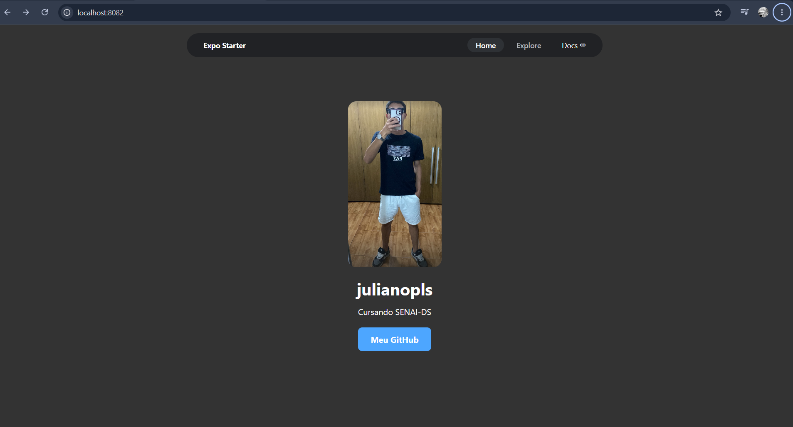

# julianopls

Tela de perfil simples feita com **React Native** e **Expo**. Mostra a foto, o nome, o curso e um botão que abre o GitHub.

## Preview



## Tecnologias

- [React Native](https://reactnative.dev/)
- [Expo](https://expo.dev/)
- [Expo Router](https://docs.expo.dev/router/introduction/)
- TypeScript

## Como rodar

1. Instale as dependências:

   ```bash
   npm install
   ```

2. Inicie o projeto:

   ```bash
   npx expo start
   ```

3. No terminal, escolha onde abrir:

   - `w` para abrir no navegador
   - `a` para o emulador Android
   - `i` para o simulador iOS
   - ou escaneie o QR code com o app **Expo Go** no celular

## Estrutura

```
app/
  (tabs)/
    index.tsx      # Tela inicial (HomeScreen)
assets/
  images/
    julianopls.png # Foto de perfil
    teste.png      # Imagem de preview usada neste README
```

## Funcionalidades

- Foto de perfil
- Nome e curso (SENAI-DS)
- Botão **Abrir GitHub** que leva para [github.com/julianopls](https://github.com/julianopls)

## Autor

**julianopls**
Cursando SENAI-DS
[GitHub](https://github.com/julianopls)
